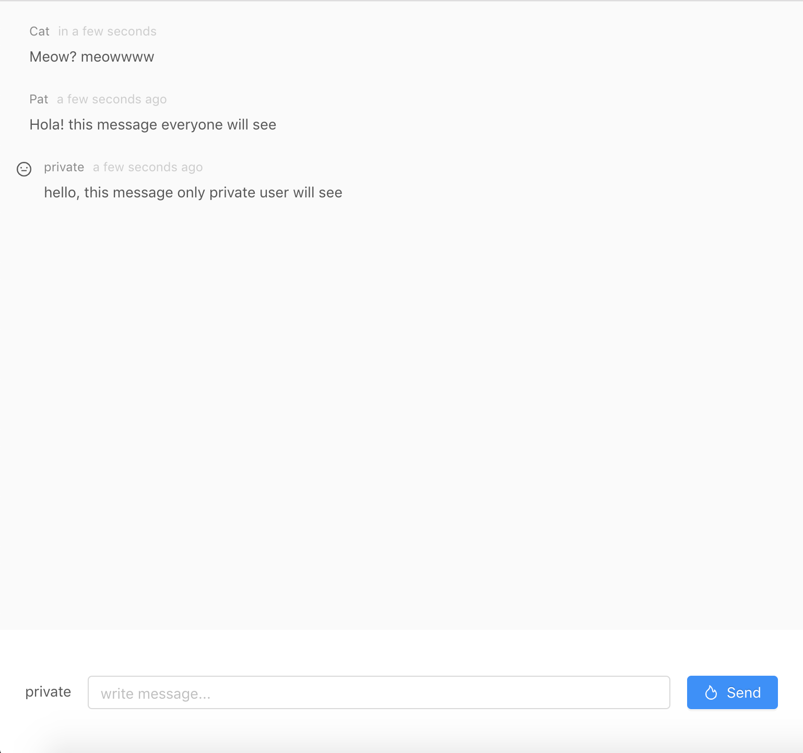
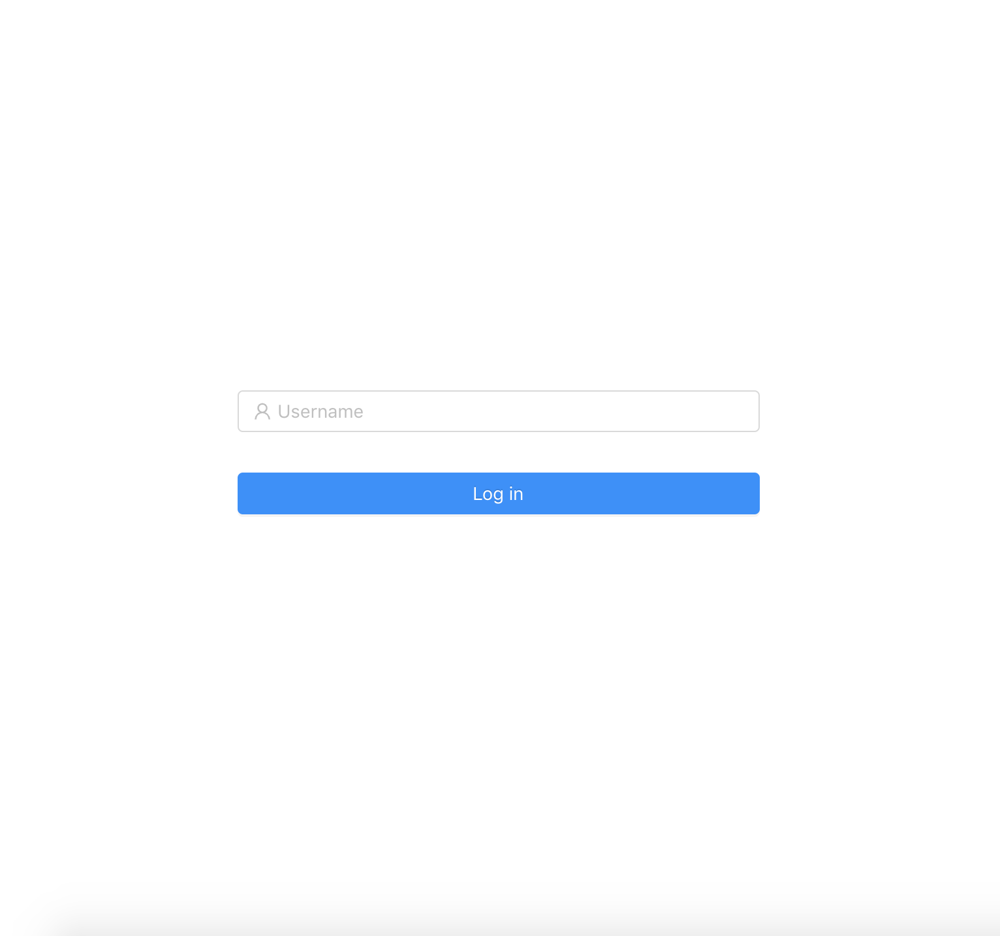

Simple Chat using [Pusher](https://pusher.com/) and React

to serve this project, you need to create environment file (.env) and add pusher `key` (you can look at .env-example)
and api server which we will provide code to github soon.

For this simple chat. There're 2 roles, public user and private user.

public user can only subscribe public channel but private user can subscribe public and [private channel](https://pusher.com/docs/client_api_guide/client_private_channels)

private user can be logged in by using *private* as username for login. for public user, just use anything other than *private* as username

### Chat room 

### Login

